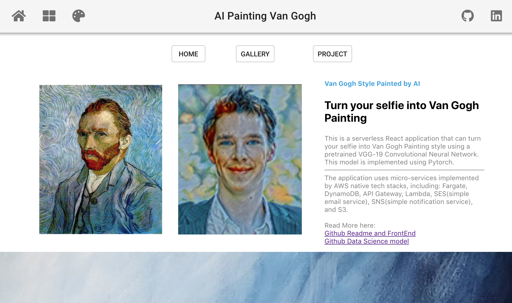
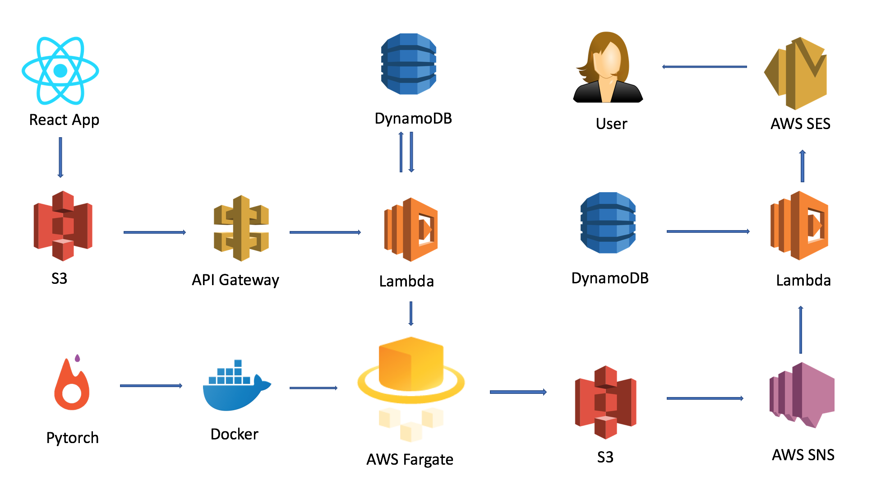
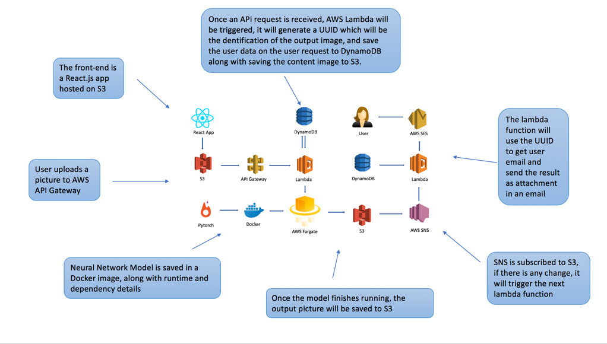
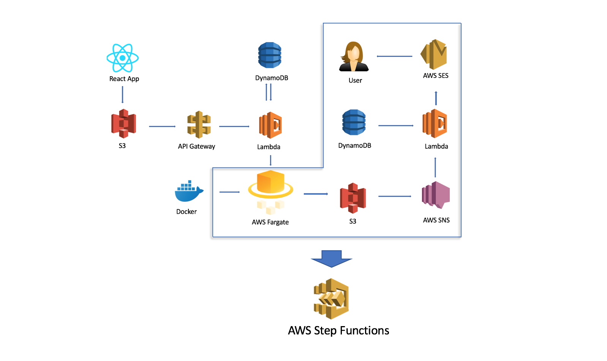

# AI Painting Van Gogh

### Live Site:
http://style-transfer-frontend.s3-website-us-west-2.amazonaws.com/

### Data Science Model:
https://github.com/vivian5668/VanGogh-Service

This is a serverless React application that can turn your selfie into Van Gogh Painting style using a pretrained VGG-19 Convolutional Neural Network. This model is implemented using Pytorch.

The application uses micro-services implemented by AWS native tech stacks, including: Fargate, DynamoDB, API Gateway, Lambda, SES(simple email service), SNS(simple notification service), StepFunctions and S3.

# Application Tech Stacks

# Data Flow

## Front End - React
This app is hosted on S3 as a static Front-end app.

if you need replicate this site using React and S3,
 edit anything and upload to S3 using the command below. Make sure you 
 have aws certificate and cli set up.
run `npm run build`, 
`cd build`,
and `aws s3 sync . s3://style-transfer-frontend/`

## Further Development
-- Introduce AWS StepFunstions to manage all micro-services

References:
---
https://academind.com/learn/react/snippets/image-upload/
https://pytorch.org/tutorials/advanced/neural_style_tutorial.html